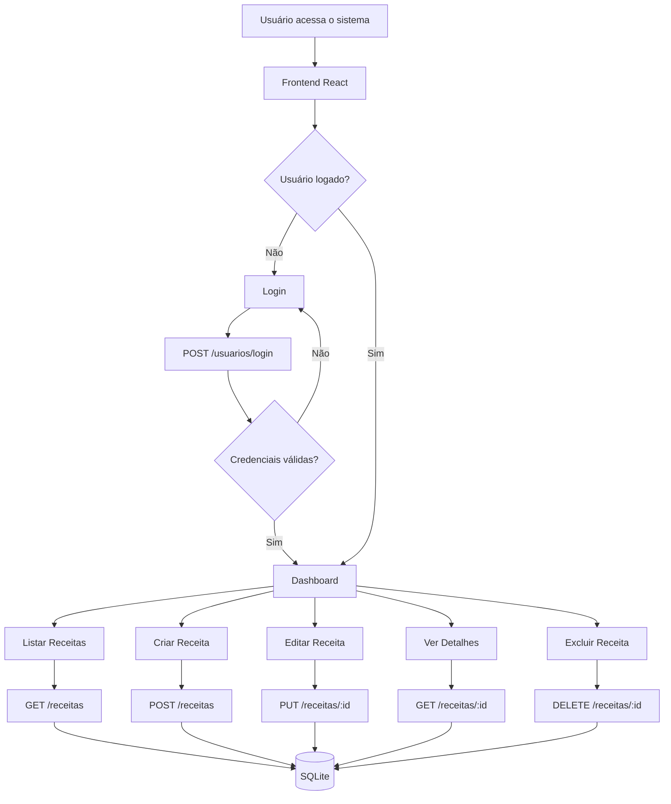
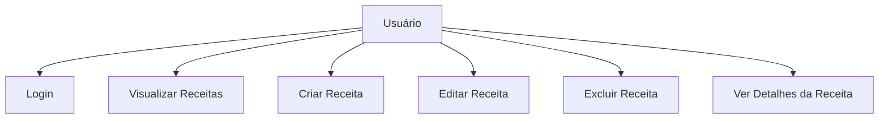
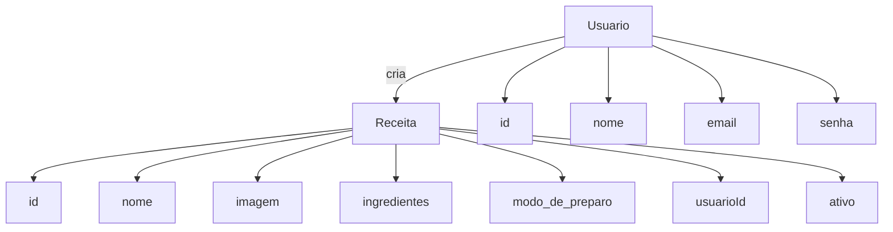
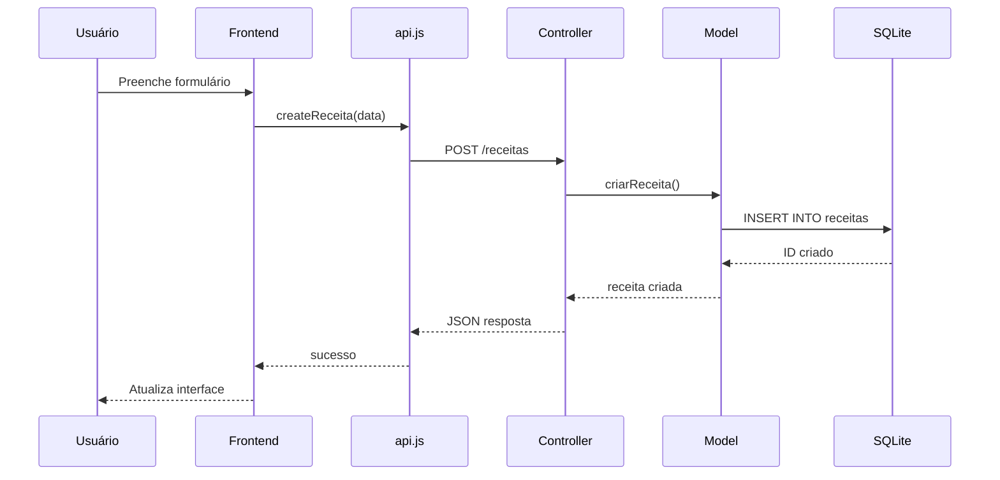

# Diagramas do projeto - Sistema de Receitas Culinárias

## Diagrama de Fluxo do Sistema

## Descrição

O diagrama de fluxo representa o caminho que o usuário percorre dentro do sistema de receitas, desde o acesso inicial até as operações de CRUD.

## Principais elementos

- Usuário  
- Frontend React  
- API Backend  
- Banco de dados SQLite  

## Relações

- O frontend comunica com o backend via requisições HTTP  
- O backend processa regras de negócio e acessa o banco  
- O banco armazena e retorna dados das receitas e usuários  

# Diagrama de caso de uso

## Descrição

O diagrama de caso de uso representa as funcionalidades disponíveis para o usuário dentro do sistema.

## Principais elementos

- Usuário (ator principal)  
- Funcionalidades do sistema (casos de uso)  

## Relações

- O usuário interage diretamente com todas as funcionalidades  
- Cada caso de uso representa uma ação disponível no sistema  
- As ações dependem da autenticação para acesso completo  

## Diagrama de Entidades 

## Descrição

O diagrama de entidades representa a estrutura do banco de dados e como as tabelas se relacionam.

## Principais elementos

- Usuário  
- Receita  

## Relações

- Um usuário pode criar várias receitas  
- Cada receita pertence a um único usuário  
- A relação é de 1 para muitos (1:N)  

## Diagrama de Sequência

## Descrição

O diagrama de sequência mostra como ocorre a criação de uma receita passo a passo dentro do sistema.

## Principais elementos

- Usuário  
- Frontend React  
- API  
- Controller  
- Model  
- Banco de dados  

## Relações

- O usuário inicia a ação no frontend  
- O frontend envia requisição para API  
- O backend processa a lógica e salva no banco  
- O banco retorna confirmação de criação  
- O frontend atualiza a interface  
