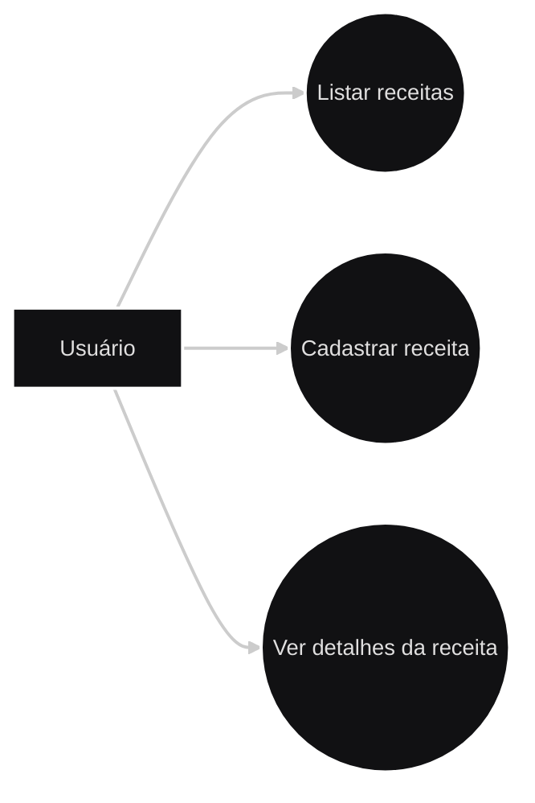

# Diagramas 

## Diagrama de fluxo


```text
  [ Usuário ]
       |
       ▼
  [ Front-End ] 
    • Formulários de cadastro e login
    • Botão para cadastrar/ listar receitas
    • Envio de requisição para a API
    
       |
       ▼
  [ Back-End ]
    • Implementação de endpoints
    • Autenticação de usuários
       |
       ▼
  [ Banco de Dados ]
    • Armazenamento de usuários
    • Armazenamento de receitas de usuários

```
# Diagramas UML do projeto - Sistema de Receitas Culinarias 

## Diagrama de Casos de Uso



**Descrição:** Representa os **atores** e **funcionalidades principais** do sistema.

Neste exemplo, o **Usuario** pode cadastrar receitas, vizualizar receitas cadastradas e acessar os detalhes de cada receita.

**Principais elementos:**

- **Atores:** Usuário

- **Casos de Uso:** Cadastrar receita, Vizualizar receitas, Ver detalhe da receita

- **Atualizado em:** 15/03/2026 - Equipe 1