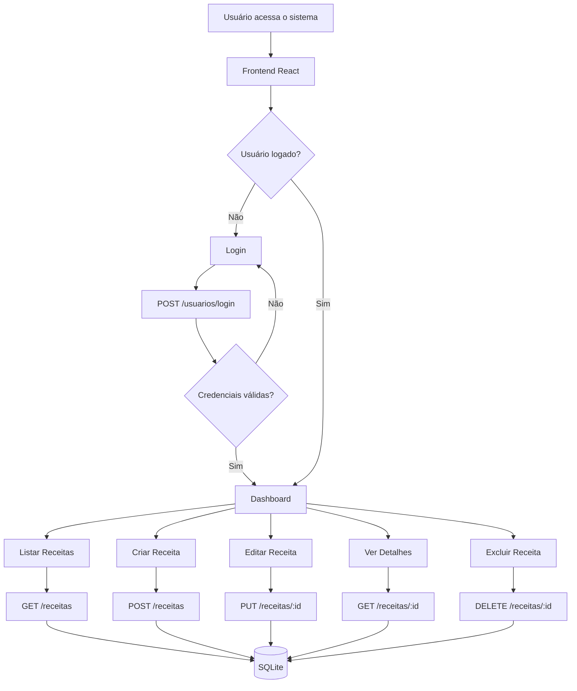
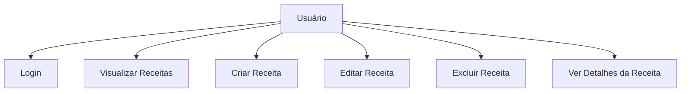
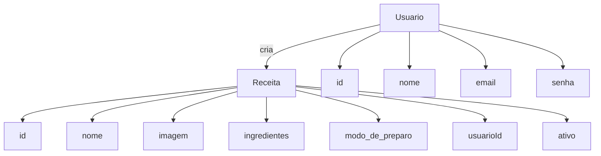
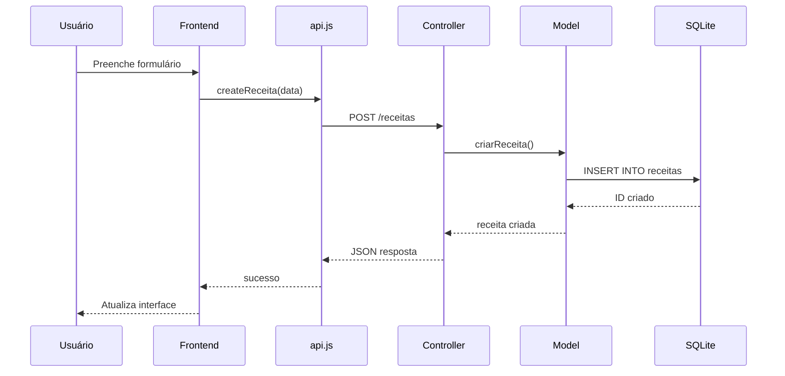

# Documentação Final do Projeto  
## **Sistema de receitas**

**Equipe:** Gabriele Alves, Clarisse Gondim e José Vianei 
**Disciplina:** Projeto Integrador 2  
**Instituição:** IFCE – Campus Maranguape  
**Semestre:** 2026.2  

---

# Sumário

1. [Introdução](#1-introdução)  
   1.1 [Objetivo do Documento](#11-objetivo-do-documento)  
   1.2 [Público-alvo](#12-público-alvo)  

2. [Visão Geral do Sistema](#2-visão-geral-do-sistema)  
   2.1 [Descrição Resumida](#21-descrição-resumida)  
   2.2 [Funcionalidades Principais](#22-funcionalidades-principais)  
   2.3 [Escopo do Sistema](#23-escopo-do-sistema)  

3. [Requisitos do Sistema](#3-requisitos-do-sistema)  
   3.1 [Requisitos Funcionais](#31-requisitos-funcionais)  
   3.2 [Requisitos Não Funcionais](#32-requisitos-não-funcionais)  

4. [Arquitetura e Tecnologias Utilizadas](#4-arquitetura-e-tecnologias-utilizadas)  
   4.1 [Arquitetura Geral](#41-arquitetura-geral)  
   4.2 [Tecnologias Utilizadas](#42-tecnologias-utilizadas)  
   4.3 [Padrões e Boas Práticas Adotados](#43-padrões-e-boas-práticas-adotados)  

5. [Diagramas do Sistema](#5-diagramas-do-sistema)
   5.1 [Diagrama de Fluxo](#51-diagrama-de-fluxo)  
   5.2 [Diagrama de Casos de Uso](#51-diagrama-de-casos-de-uso)  
   5.3 [Diagrama de Entidades](#53-diagrama-de-entidades)  
   5.4 [Diagrama de Sequência (Opcional)](#54-diagrama-de-sequência-opcional)   

6. [Descrição dos Módulos e Componentes](#6-descrição-dos-módulos-e-componentes)  
   6.1 [Organização das Pastas](#61-organização-das-pastas)  
   6.2 [Módulos do Sistema](#62-módulos-do-sistema)  
   6.3 [Fluxo de uma Operação Importante](#63-fluxo-de-uma-operação-importante)  

7. [Guia de Instalação e Execução](#7-guia-de-instalação-e-execução)  
   7.1 [Pré-requisitos](#71-pré-requisitos)  
   7.2 [Como Clonar o Repositório](#72-como-clonar-o-repositório)  
   7.3 [Instalação e Execução do Back-end](#73-instalação-e-execução-do-back-end)  
   7.4 [Instalação e Execução do Front-end](#74-instalação-e-execução-do-front-end)  

8. [Manual do Usuário](#8-manual-do-usuário)  
   8.1 [Tela Inicial](#81-tela-inicial)  
   8.2 [Login e Cadastro](#82-login-e-cadastro)  
   8.3 [Cadastro de Receitas](#83-cadastro-de-receitas)  
   8.4 [Edição e Exclusão](#84-edição-e-exclusão)  
   8.5 [Erros Comuns e Soluções](#85-erros-comuns-e-soluções)
   
9. [Decisões de Projeto e Limitações](#9-decisões-de-projeto-e-limitações)  
   9.1 [Decisões Importantes](#91-decisões-importantes)  
   9.2 [Limitações da Versão Atual](#92-limitações-da-versão-atual)  

10. [Testes Unitários com Jest](#10-testes-unitários-com-jest)  
    10.1 [Objetivo dos Testes](#101-objetivo-dos-testes)  
    10.2 [Tecnologias Utilizadas](#102-tecnologias-utilizadas)  
    10.3 [Como Executar os Testes](#103-como-executar-os-testes)  
    10.4 [Organização dos Arquivos de Teste](#104-organização-dos-arquivos-de-teste)  
    10.5 [Testes Implementados no Projeto](#105-testes-implementados-no-projeto)  
    10.6 [Exemplo de Teste Criado](#106-exemplo-de-teste-criado)  
    10.7 [Benefícios dos Testes Unitários](#107-benefícios-dos-testes-unitários)

11. [Referências](#11-referencias)

---
# 1. Introdução
## 1.1 Objetivo do Documento
Este documento reúne toda a documentação técnica e de usuário do sistema **Sistema de receitas**, desenvolvido como parte da disciplina Projeto Integrador 2. 
Seu objetivo é permitir que desenvolvedores, professores e avaliadores compreendam como o sistema funciona, sua arquitetura, requisitos, tecnologias usadas, estrutura interna e modo de utilização. Também fornece instruções de instalação e execução, além de registrar decisões de projeto e apresentar os testes unitários desenvolvidos no backend.

## 1.2 Público-alvo
- Professor avaliador da disciplina; 
- Desenvolvedores que pretendem estudar, manter ou expandir o sistema;
- Usuários finais (apenas para as seções do manual de uso)

---


# 2. Visão Geral do Sistema

## 2.1 Descrição Resumida
O **Sistema de receitas** é uma aplicação desenvolvida para entusiastas da culinária que desejam organizar e gerenciar suas receitas de forma prática e digital. 
O sistema permite o cadastro de receitas detalhadas, contendo informações como nome, imagem ilustrativa, lista de ingredientes e o passo a passo do modo de preparo.

O projeto foi pensado para oferecer uma interface limpa e intuitiva, facilitando o armazenamento de memórias gastronômicas e a consulta rápida a pratos favoritos, funcionando como um livro de receitas digital e personalizado.

## 2.2 Funcionalidades Principais
-Cadastro de usuários: Criação de conta para acesso ao sistema;
-Login: Acesso seguro via e-mail e senha (com criptografia bcrypt);
-Gestão de Receitas: Cadastro completo incluindo nome, imagem, ingredientes e modo de preparo;
-Listagem Dinâmica: Visualização de todas as receitas cadastradas no banco de dados;
-Edição de Receitas: Alteração de dados de receitas já existentes;
-Exclusão de Receitas: Remoção definitiva de registros do sistema.

## 2.3 Escopo do Sistema
### O que o sistema faz:
- Realiza autenticação de usuários  
- Registra e armazena receitas com dados estruturados; 
- Permite a visualização detalhada de cada prato; 
- Garante a persistência dos dados através de um banco de dados better-sqlite-3.   

### O que NÃO faz (fora do escopo):
- Avaliação de receitas (sistema de estrelas); 
- Compartilhamento de receitas em redes sociais; 
- Filtro avançado por tempo de preparo ou custo.  

---

# 3. Requisitos do Sistema

## 3.1 Requisitos Funcionais

## Requisitos Funcionais (RF)

- **RF01:** O sistema deve permitir cadastro de usuários com nome, email e senha.
- **RF02:** O sistema deve permitir que o usuário faça login informando e-mail e senha.
- **RF03:** O sistema deve permitir que o usuário cadastre receitas.
- **RF04:** O sistema deve permitir que o usuário exclua receitas.
- **RF05:** O sistema deve permitir que o usuário edite receitas.
- **RF06:** O sistema deve armazenar as informações de usuários e receitas no banco de dados.


## 3.2 Requisitos Não Funcionais

- **RNF01:** O sistema deve estar disponível 24h por dia.
- **RNF02:** O sistema deve possuir interface simples e intuitiva.
- **RNF03:** As senhas dos usuários devem ser armazenadas de forma segura (criptografadas).
- **RNF04:** O sistema deve garantir a integridade dos dados armazenados no banco.
- **RNF05:** O sistema deve responder às requisições em tempo adequado.
---

# 4. Arquitetura e Tecnologias Utilizadas

## 4.1 Arquitetura Geral
O **sistema de receitas** utiliza arquitetura **cliente-servidor**, onde:

- **frontend** Desenvolvido em React, foca na experiência do usuário, consumo da API e renderização dinâmica das receitas.  
- **backend** Construído com Node.js e Express, fornece uma API REST que processa as requisições, aplica regras de negócio e gerencia a segurança.
- **Banco de Dados:** A persistência dos dados é realizada de forma local utilizando o better-sqlite-3, garantindo leveza e praticidade para o ambiente de desenvolvimento.

## 4.2 Tecnologias Utilizadas
**Front-end:**

- **React (v19.2):** Biblioteca principal para construção da interface baseada em componentes.
- **Vite (v8.0):** Ferramenta de build e automatização que garante um ambiente de desenvolvimento rápido.
- **React Router DOM (v7.14):** Gerenciamento de rotas e navegação interna da aplicação.
- **Fetch API:** Interface nativa para comunicação assíncrona com o Backend.
- **ESLint:** Padronização e análise estática do código para evitar erros de desenvolvimento.

**Back-end:**

- **Node.js:** Ambiente de execução Javascript no servidor.
- **Express**: Framework minimalista para criação das rotas e middlewares da API.
- **better-sqlite-3:** Banco de dados relacional para persistência local.
- **CORS:** Middleware para permitir que o Frontend acesse os recursos da API de forma segura.

## 4.3 Padrões e Boas Práticas Adotados
O projeto foi estruturado seguindo padrões de mercado para garantir a manutenibilidade e escalabilidade do código:

- **Organização em Camadas (Backend):** O servidor foi dividido em camadas de responsabilidade única: Routes (definição dos pontos de acesso), Controllers (processamento das requisições e lógica de entrada) e Models (comunicação direta com o banco de dados).
- **Componentização (Frontend):** A interface foi dividida em componentes reutilizáveis e páginas (Pages), facilitando a manutenção visual e a lógica de estado do React.
- **Clean Code:** Aplicação de nomes semânticos para variáveis e funções, além da modularização de arquivos para evitar funções excessivamente extensas.
- **Tratamento de Erros:** Implementação de respostas HTTP adequadas (como códigos 200 para sucesso e 400/500 para erros), garantindo que o Frontend possa informar ao usuário o que ocorreu em cada operação.
- **Testes Automatizados:** O projeto conta com rotinas de testes unitários para validar a integridade das rotas e garantir que novas funcionalidades não quebrem o que já foi desenvolvido.

--

# 5. Diagramas do Sistema

## Diagrama de Fluxo  



## 5.2 Diagrama de Casos de Uso

 Diagrama de caso de uso




## 5.3 Diagrama de Entidades 




## 5.4 Diagrama de sequência




---

# 6. Descrição dos Módulos e Componentes

### **Backend**
```
backend/
├── src/
│   ├── controllers/            # Recebe as requisições e envia as respostas HTTP
│   │   ├── receitasController.js
│   │   └── usuariosController.js
│   ├── core/                   # Camada de lógica de negócio (Casos de Uso)
│   │   ├── atualizarReceitaCore.js
│   │   └── buscarReceitaCore.js
|   |   └── criarReceitaCore.js
|   |   └── deletarReceitaCore.js
|   |   └── listarReceitaCore.js
│   ├── data/                   # Gerenciamento de persistência e mocks
|   |  └── receitas.js
│   ├── database/               # Configuração e inicialização do better-sqlite-3
│   │   ├── database.js
│   │   └── init.js
│   ├── middlewares/            # Funções globais (Tratamento de erros e Logs)
│   │   └── errorHandler.js
|   |   └── logger.js
│   ├── models/                 # Definição das entidades do sistema
|   |  └── receitaModel.js
|   |  └── usuarioModel.js
│   ├── routes/                 # Definição dos endpoints da API
│   │   ├── receitasRoutes.js
│   │   └── usuariosRoutes.js
│   ├── app.js                  # Configurações do Express e Middlewares
│   └── server.js               # Inicialização do servidor Node.js
├── test/                       # Testes automatizados (Jest)
|   └── atualizarReceitaCore.js
│   └── criarReceitaCore.test.js
|   └── deletarReceitaCore.js
├── coverage/                   # Relatórios de cobertura de testes
├── package.json                # Dependências e scripts do projeto
```


### **Docs**
```
docs/
│   ├── api_design.md          
│   ├── atas.md               # Registro de decisões tomadas em reuniões de equipe
|   ├── requisitos.md          # Documentação de Requisitos Funcionais e Não Funcionais
│   ├── diagramas.md           # Diagramas UML do projeto
│   ├── estimativas.md         # Estimativas de esforço (story points)              
│   ├── quadro-scrum.md        # Acompanhamento do progresso (To Do, Doing, Done)
|   ├── riscos.md              # Matriz de riscos e planos de mitigação
|   ├── sprints.md             # Planejamento e review dos ciclos de desenvolvimento
|   ├── documentacao-final.md  # Versão consolidada do relatório do projeto
```


### **Frontend**
```
frontend/
├── public/                 # Arquivos estáticos (ícones, favicon)
├── src/
│   ├── assets/             # Imagens e vetores (ex: hero.png, react.svg)
│   ├── auth/               # Gerenciamento de autenticação e rotas privadas
│   │   ├── AuthProvider.jsx
│   │   ├── FakeJwt.js
│   │   └── PrivateRoute.jsx
│   ├── components/         # Componentes globais e reutilizáveis
│   │   ├── CardReceita.jsx
│   │   ├── CardReceita.module.css
│   │   ├── Footer.jsx
|   |   ├── Footer.module.css
│   │   ├── NavBar.jsx
|   |   ├── Navbar.module.css
│   │   └── ScrollToTop.jsx
│   ├── mock/               # Dados temporários para testes de interface
│   │   └── receitasData.js
│   ├── pages/              # Telas principais da aplicação
│   │   ├── receitas/       
│   │   │   ├── NovaReceita.jsx
|   |   |   ├── NovaReceita.modules.css
│   │   │   ├── ReceitaDetalhes.jsx
│   │   │   ├── ReceitaLista.jsx
|   |   |   ├── ReceitaLista.modules.css
|   |   |   └── ReceitasLayout.jsx
│   │   ├── Dashboard.jsx
│   │   ├── Home.jsx
│   │   ├── Login.jsx
|   |   ├── NotFound.jsx
│   │   └── Sobre.jsx
│   ├── services/           # Configuração de chamadas à API (Fetch)
│   │   └── api.js
│   ├── App.jsx             # Definição de rotas e estrutura global
│   ├── main.jsx            # Ponto de entrada do React
│   └── App.css             # Estilos globais
├── .gitignore                        # Arquivos ignorados no Git
├── eslint.config.js                  # Configuração ESLint
├── index.html              # Template principal HTML5
├── package.json                      # Dependências e scripts do front
├── package-lock.json
├──README.md                         # Documentação do frontend
└── vite.config.js                    # Configuração do Vite
```

---

## 6.2 Modulos do Sistema

- **Acesso (Login):** Responsável por validar a entrada do usuário no sistema, permitindo que apenas pessoas autorizadas visualizem e gerenciem o catálogo de receitas.
- **Gestão de Receitas (CRUD):** Módulo principal que permite o controle total das receitas (Cadastro, Leitura, Edição e Exclusão).
- **Processamento de Dados (Core):** Camada lógica que isola as regras de negócio (como validações e cálculos de rendimento) das interfaces de usuário e do banco de dados.
- **Persistência Local:** Gerenciamento do banco de dados SQLite, garantindo que as informações fiquem armazenadas de forma segura no servidor local.


---


### 6.3 Fluxo de uma Operação Importante – Criar Receita
O processo de cadastro de uma nova receita no Sistema de Receitas demonstra a integração entre a interface e o processamento de dados. Abaixo está o fluxo passo a passo:

1. Preenchimento do Formulário (Frontend)
O usuário, já logado, acessa o formulário de cadastro e insere:
Título da Receita;
Lista de Ingredientes;
Instruções de Preparo;
Ao finalizar, o usuário clica em "Salvar".

2. Envio de Dados via API
O Frontend (React) organiza as informações em um objeto JSON e realiza uma requisição POST /receitas. O Vite garante que essa comunicação seja rápida e eficiente durante o desenvolvimento e produção.

3. Processamento e Validação (Backend)
O servidor Node.js recebe a requisição e executa a seguinte sequência:
Validação de Regra de Negócio: O arquivo criarReceitaCore.js verifica se os dados são válidos (ex: se o nome da receita não está vazio).
Persistência no Banco: O receitasController.js aciona o modelo de dados, que utiliza o better-sqlite3 para gravar a nova receita permanentemente no arquivo database.sqlite.
Finalização: O sistema limpa quaisquer dados temporários de memória e gera uma resposta de sucesso.

4. Feedback ao Usuário
O Frontend recebe a resposta positiva do servidor (Status 201) e atualiza a interface, exibindo a nova receita na lista principal e confirmando a operação para o usuário através de uma notificação visual.

---


# 7. Guia de Instalação e Execução

## 7.1 Pré-requisitos
Node.js (v18 ou superior): Ambiente de execução Javascript.

Git: Para clonagem e versionamento do código.

Gerenciador de pacotes (NPM): Já vem instalado com o Node.js.

## 7.2 Como Clonar o Repositório
```
git clone https://github.com/alvesgabb/projeto-integrador-web3
```

## 7.3 Instalação e Execução - backend
```
cd backend
  Entra na pasta do backend para executar os comandos dentro dela.

npm install
  Baixa e instala todas as dependências necessárias do projeto.

npm run dev
  Inicia o servidor backend em modo de desenvolvimento (com recarregamento automático).
```

## 7.4 Instalação e Execução – Frontend

```
cd frontend
  Entra na pasta do frontend.

npm install
  Instala todas as dependências do projeto React.

npm run dev
  Inicia o servidor de desenvolvimento do frontend, abrindo o sistema no navegador.
```
Disponível em: **http://localhost:5173**

---

# 8. Manual do Usuário

## 8.1 Tela Inicial 
A tela de início apresenta uma visão geral do sistema e facilita o acesso rápido às principais áreas de gestão.
- Barra de Navegação (Navbar):
- Início: Retorna à tela principal de boas-vindas.
- Receitas: Leva ao catálogo geral de criações culinárias.
- Sobre: Informações institucionais e sobre o desenvolvimento da plataforma.
- Minha Área: Acesso ao painel administrativo pessoal do usuário.
- Sair: Encerra a sessão atual com segurança.
- Seções de Destaque:
  - Catálogo: Descrição do acesso centralizado às receitas.
  - Cadastro: Chamada para adição de novos pratos.
 - Gestão: Link para o dashboard exclusivo de controle.
 - Botão "Acessar Minha Conta": Atalho central para o portal do usuário.

## 8.2 Login e Cadastro
Acesso:
- Na tela de login, insira seu e-mail e senha.
- Clique em "Entrar".
- Validação: O sistema consulta o banco de dados SQLite. Se os dados coincidirem, o usuário é redirecionado para a Home.

## 8.3 Cadastro de Receitas
1. O usuário acessa a opção "Cadastrar Receita".
2. Preenche os dados obrigatórios no formulário.
3. O sistema processa a informação através do criarReceitaCore.js no backend.
4. Após a confirmação, a nova receita aparece instantaneamente no catálogo.


# 8.4 Solução de Problemas
- Imagem não carrega: Verifique se o caminho da imagem está correto.
- Botões não respondem: Certifique-se de que o servidor backend (Node.js) está rodando na porta 3000.
- Dados não salvos: O sistema exige que os campos principais não estejam vazios para garantir a qualidade do catálogo.


## 8.5 Erros Comuns
- **Campos faltando** → preencha todos os campos.  
- **Erro ao enviar arquivo** → verifique formato.
---


# 9. Decisões de Projeto e Limitações

## 9.1 Desições Importantes
- React: Escolhido pela facilidade de criar componentes reutilizáveis e por deixar a página mais rápida, sem precisar recarregar o navegador a cada clique.
- Node.js + Express: Usamos para manter o JavaScript tanto no site quanto no servidor. O Express é simples e permitiu criar as rotas do sistema sem complicações.
- SQLite (better-sqlite-3): Optamos por um banco de dados local por ser leve, dispensar configuração de servidores externos e garantir que o projeto funcione em qualquer máquina.
- Camada Core: Criamos uma pasta específica para as regras de negócio. Isso organiza o código e facilita na hora de testar se tudo está funcionando certo.


## 9.2 Limitações da Versão Atual
- Login Simples: O acesso atual é funcional, mas ainda não possui níveis avançados de segurança (como tokens JWT), o que está planejado para o futuro.
- Imagens Locais: As fotos das receitas ainda via links. No futuro, queremos que o usuário possa fazer o upload direto do seu arquivo.
- Filtros de Busca: Atualmente listamos tudo, mas falta a opção de filtrar receitas por ingredientes ou tempo de preparo.
- Ajustes no Celular: O sistema foi focado no computador, então o visual no celular ainda precisa de alguns ajustes para ficar perfeito.


# 10. Testes Unitários com Jest

Esta seção apresenta os testes unitários implementados com o framework Jest, aplicados ao sistema de receitas culinárias.
Esses testes garantem a confiabilidade das regras de negócio do backend, principalmente na camada Core (lógica principal do sistema).

## 10.1 Objetivo

Os testes unitários foram criados para:

- Validar funções isoladas da lógica do sistema;
- Garantir o correto funcionamento das regras de negócio;
- Verificar cenários de erro e entradas inválidas;
- Evitar regressões ao alterar o código;
- Aumentar a confiabilidade geral da aplicação.

## 10.2 Tecnologias Utilizadas
- Jest → framework de testes unitários
- Node.js → ambiente de execução dos testes

## 10.3 Como Executar os Testes

Instalar dependências:
```
npm install
```
Executar os testes:
```
npm run test
```
Os testes são reconhecidos automaticamente pelos arquivos:
```
*.test.js
*.spec.js
```

## 10.4 Organização dos Testes

Os testes foram organizados na pasta:
```
/backend/test
```

## 10.5 Testes Implementados no Projeto

A estratégia de testes do sistema de receitas culinárias foca na validação da Core Business Logic, garantindo que as principais operações funcionem corretamente.

Os testes utilizam listas simuladas (mocks simples em memória), sem dependência do banco de dados.

## Categorias de Testes

| Categoria | Objetivo | Arquivos |
|----------|----------|----------|
| Criação de Receita | Validar criação de receitas com dados corretos e padrões | criarReceitaCore.test.js |
| Atualização de Receita | Validar atualização de campos e regras de negócio | atualizarReceitaCore.test.js |
| Exclusão de Receita | Garantir remoção correta e tratamento de erros | deletarReceitaCore.test.js |
| Validação de Campos | Verificar obrigatoriedade de dados | criarReceitaCore.test.js |
| Tratamento de Erros | Garantir que funções lancem erros corretamente | todos os testes |

## 10.6 Exemplos de Testes Implementados
- Exemplo 1: Criação de Receita

Arquivo: criarReceitaCore.test.js
```
test("cria receita válida", () => {
  const r = criarReceitaCore({
    nome: "Bolo de Chocolate",
    imagem: "link.jpg",
    ingredientes: ["Farinha", "Ovos"],
    modo_de_preparo: "Misturar e assar",
    usuarioId: "usuario",
    ativo: true
  });

  expect(r.nome).toBe("Bolo de Chocolate");
  expect(r.ingredientes).toEqual([
    "2 xícaras de farinha de trigo",
    "3 ovos",
    "1 xícara de chocolate em pó"
  ]);
  expect(r.modo_de_preparo).toBe("Misture todos os ingredientes e asse por 40 minutos a 180°C.");
  expect(r.usuarioId).toBe("usuario");
  expect(r.ativo).toBe(true);
});
```
- Exemplo 2: Validação de Campos Obrigatórios
```
test("lança erro se nome não for enviado", () => {
  expect(() =>
    criarReceitaCore({
      ingredientes: ["Farinha"]
    })
  ).toThrow("Campos obrigatórios: nome e ingredientes");
});
```

- Exemplo 3: Atualização de Receita

Arquivo: atualizarReceitaCore.test.js
```
test("atualiza nome com trim", () => {
  const receita = atualizarReceitaCore(lista, 1, {
    nome: " Bolo de Chocolate "
  });

  expect(receita.nome).toBe("Bolo de Chocolate");
});
```

- Exemplo 4: Exclusão de Receita

Arquivo: deletarReceitaCore.test.js
```
test("deleta uma receita que existe", () => {
  deletarReceitaCore(lista, 1);
  expect(lista.length).toBe(1);
});
```

- Exemplo 5: Erro ao deletar receita inexistente
```
test("lança erro se a receita não existe", () => {
  expect(() => deletarReceitaCore(lista, 99))
    .toThrow("Receita não encontrada");
});
```

## 10.7 Benefícios dos Testes Unitários

Os testes trouxeram os seguintes benefícios ao projeto:

- Maior segurança ao modificar o código;
- Garantia de funcionamento da lógica principal;
- Redução de erros em produção;
- Facilidade de manutenção do sistema;
- Melhor entendimento das regras de negócio;
- Estrutura mais profissional e escalável.

## Conclusão

Os testes unitários garantem que o sistema de receitas culinárias funcione de forma confiável, principalmente na camada de lógica de negócio, permitindo evolução segura do projeto.


# 11. Referencias
- Material da disciplina Projeto Integrador: Orientações e requisitos fornecidos pelo IFCE.
